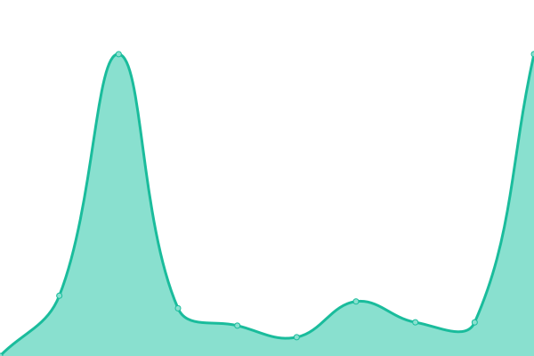

This repository contains the open-source uptime monitor and status page for [Sayless Wager](https://www.sayless.com.ng), powered by [Upptime](https://github.com/upptime/upptime).

<!--start: status pages-->
<!-- This summary is generated by Upptime (https://github.com/upptime/upptime) -->
<!-- Do not edit this manually, your changes will be overwritten -->
<!-- prettier-ignore -->
| URL | Status | History | Response Time | Uptime |
| --- | ------ | ------- | ------------- | ------ |
|  [Sayless Website](https://www.sayless.com.ng) | 🟩 Up | [sayless-website.yml](https://github.com/Sayless-Wager/uptime/commits/HEAD/history/sayless-website.yml) | 

 2147ms
     
 | 

<a href="https://Sayless-Wager.github.io/uptime/history/sayless-website">100.00%</a>
    

<!--end: status pages-->

## 📄 License

- Powered by: [Upptime](https://github.com/upptime/upptime)
- Code: [MIT](./LICENSE) © [Sayless Wager](https://www.sayless.com.ng)
- Data in the `./history` directory: [Open Database License](https://opendatacommons.org/licenses/odbl/1-0/)
